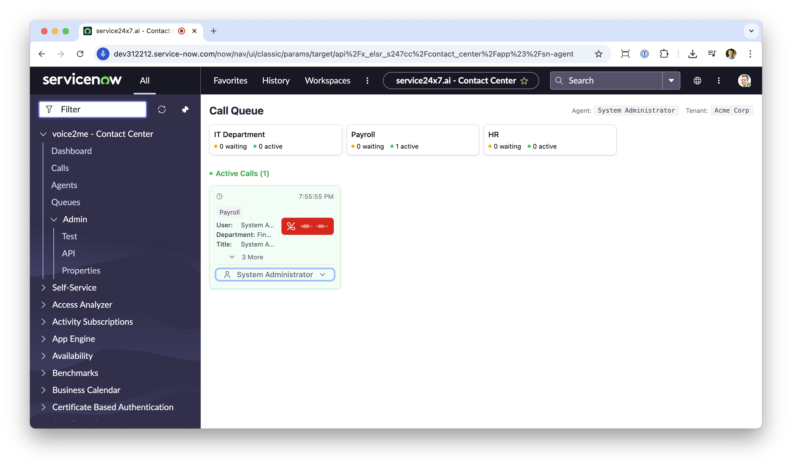
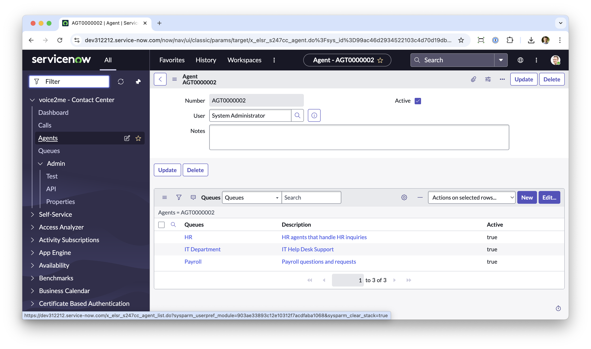
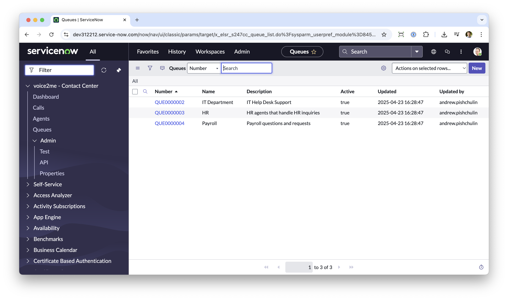
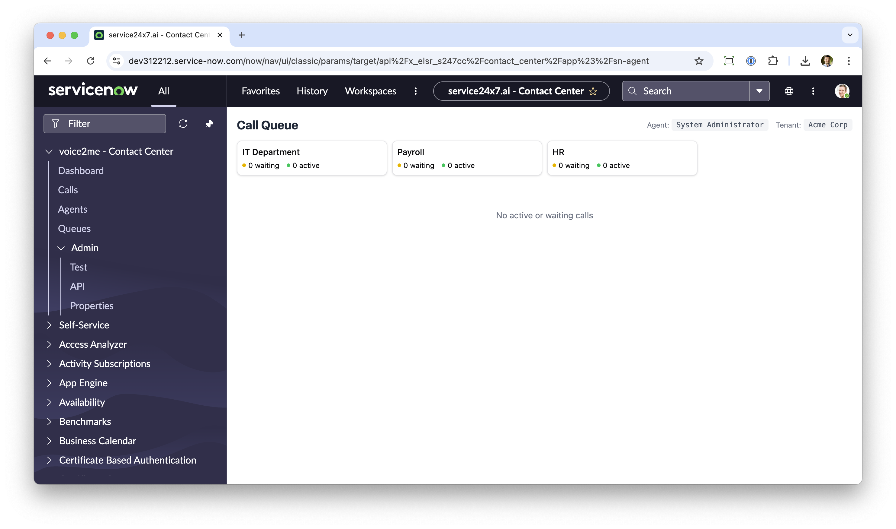
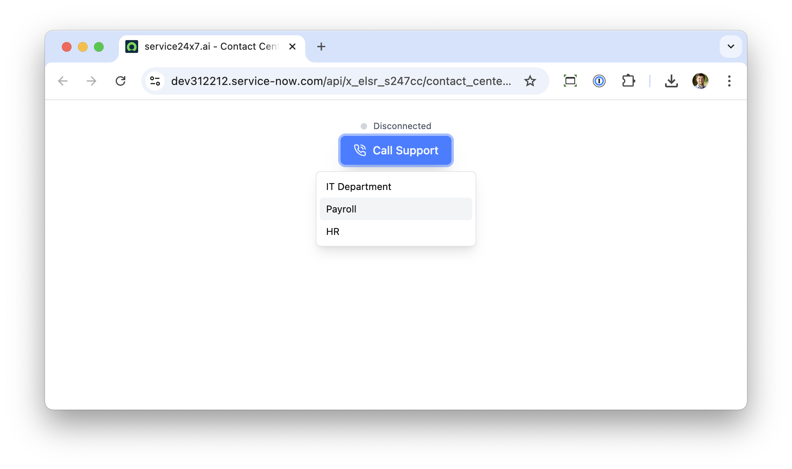
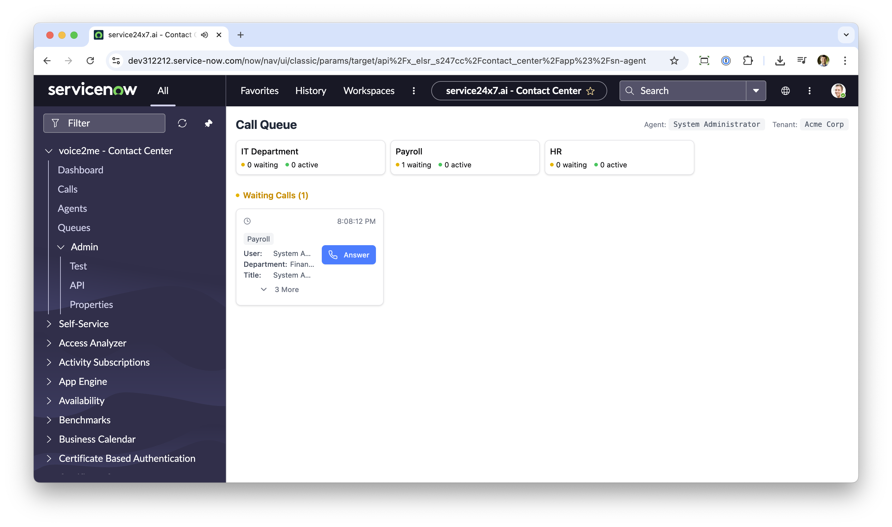
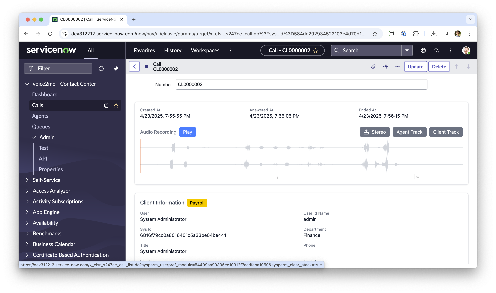
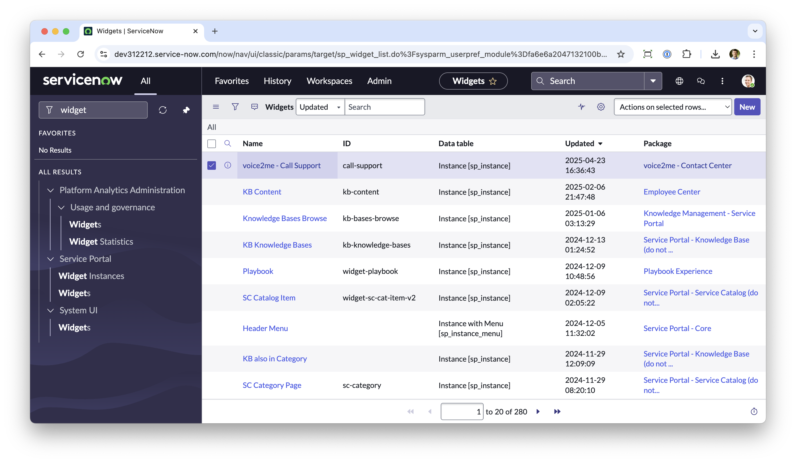
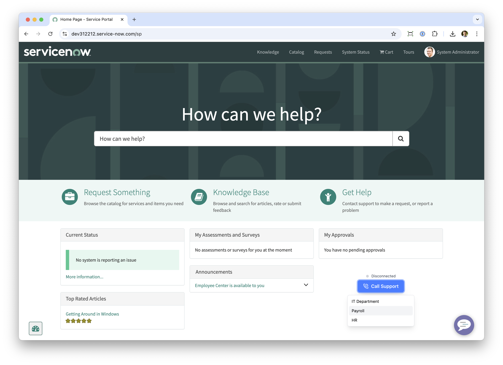

# SeviceNow Contact Center

The Contact Center app is a custom ServiceNowapp that allows you to run one or multiple contact centers on ServiceNow.

**IMPORTANT**: This version is intended for testing purposes only. You can run it on your own ServiceNow instance and/or PDI. By downloading and using the app and/or code of this repository, you agree to the following [privacy policy and terms and conditions](https://app.service24x7.ai/privacy-policy-terms.html)

## 1. Installation

Download and install the [XML Update Set](/assets/voice2me%20-%20Contact%20Center%204-23-2025.xml.zip){:download}.

## 2. Register Agents and Queues

Create a new agent record, make sure the agent is active and has assigned at least one queue:

You can also create multiple queues and assign different agents to each queue. There are three queues installed by default:

## 3. Test the Contact Center

Open the Contact Center Dashboard and you'll start monitoring the queues and waiting for incoming calls:

Click Test to open a test page where you can do a test call to the particular support queue:

Your waiting call will appear on the agent's dashboard:

The agent can pickup the call and start the conversation.

> It's better to test the app using different computers and multiple users and agents to get the full experience.

## 4. Conversations

To view the conversation, you can go to the Contact Center -> Calls and open a call record:

## 5. Service Portal

The application also includes a Service Portal widget `voice2me - Call Support` that you can put on any of your existing Service Portal pages and provide a quick way to contact the support team:

Simply add the widget to your page and it will display contact button:

## Support and latest versions

Contact [support@voice2me.ai](mailto:support@voice2me.ai) to get the latest version of the app and code.